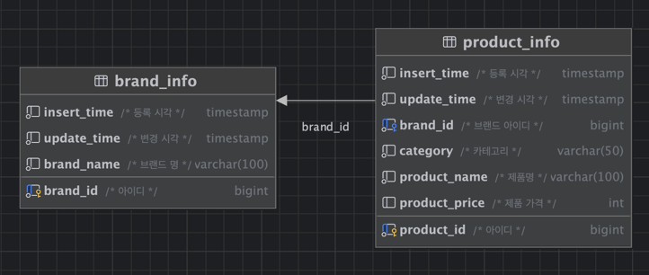
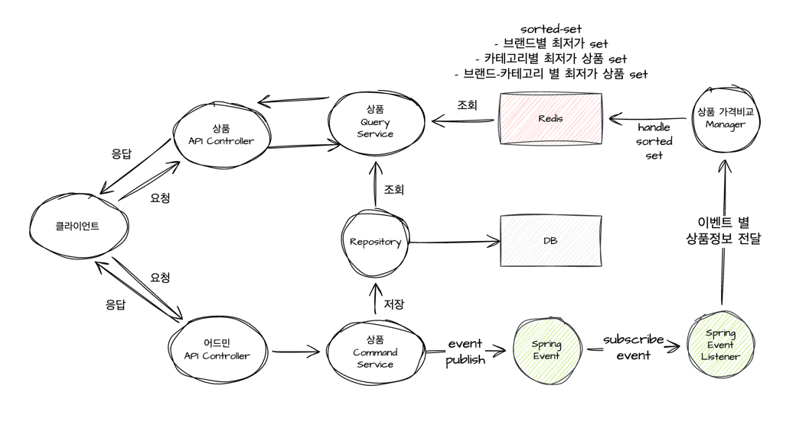
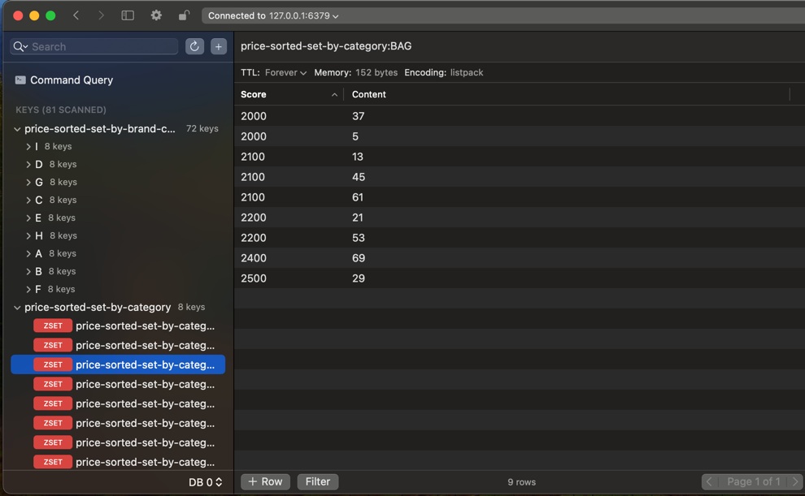
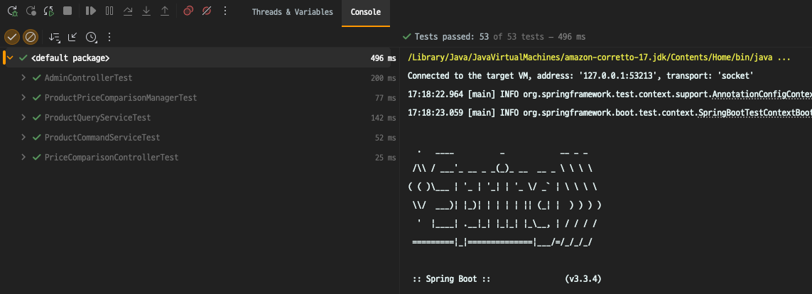

# 무신사 Backend Engineer (랭킹/데이터서비스팀) 포지션 과제 전형
# 지원자 김일환


---

### 0. 기동절차
- 주의사항
  - 본 프로젝트는 8080 포트를 사용합니다.
  - 본 프로젝트는 Embedded Redis를 사용합니다. (포트: 6379, 6380)
  - 기동 전에 8080, 6379, 6380 포트를 사용하는 프로세스가 없는지 확인해주세요.
- master 브랜치를 pull 합니다.
- pull 한 Local Repository 경로에서 아래의 커맨드를 순차적으로 실행하여 어플리케이션의 클리어 / 빌드 / 기동을 합니다.
  ```shell
  ./gradlew clean
  ./gradlew bootRun
  ```
  
- 모든 테스트를 실행 합니다.
  ```shell
  ./gradlew test
  ```
- 어플리케이션 기동 후, 아래의 URL로 접속하여 API를 테스트합니다.
  ```
    http://localhost:8080/swagger-ui.html
  ```

--- 
### 1. 개발환경
- **Language**: Java(17)
- **Frameworks**: Spring Boot(3.3.4), Spring JPA, Hibernate
- **Database**: H2, Embedded Redis (redisson)
- **Build Tool**: Gradle
- **Test**: JUnit5, Mockito
---

### 2. 프로젝트 개요
아래 기능을 제공하는 서버 개발

&nbsp;&nbsp; - 카테고리 별 최저가격 브랜드와 상품 가격, 총액을 조회하는 API.  
&nbsp;&nbsp; - 단일 브랜드로 모든 카테고리 상품을 구매할 때 최저가격에 판매하는 브랜드와 카테고리의 상품가격, 총액을 조회하는 API.  
&nbsp;&nbsp; - 카테고리 이름으로 최저, 최고 가격 브랜드와 상품 가격을 조회하는 API.  
&nbsp;&nbsp; - 광고 참여 이력 조회 API
---

### 3. DATABASE
- **H2 Database**: 
  - H2 Database를 사용하여 데이터를 저장합니다.
  - H2 Database는 Embedded 모드로 사용합니다.
  - 서버 실행 후, http://localhost:8080/h2-console 로 접속하여 데이터를 확인할 수 있습니다.
  - 접속 정보는 아래와 같습니다  
    JDBC URL: jdbc:h2:mem:product-manage-server  
    Username: sa  
    Password: (공백)
- **ERD**  


---

### 4. 프로젝트 구조
```
└── musinsa
    └── productmanageserver
        ├── common
        │   ├── constant
        │   ├── dto
        │   ├── type
        │   └── util
        ├── config
        ├── event
        │   ├── component
        │   └── message
        ├── exception
        ├── infrastucture
        │   └── redis
        │       ├── component
        │       ├── config
        │       └── service
        ├── product
        │   ├── controller
        │   ├── dto
        │   │   ├── external
        │   │   │   ├── request
        │   │   │   └── response
        │   │   └── internal
        │   ├── model
        │   ├── repository
        │   └── service
        └── properties
```

- common: 공통 모듈
  - constant: 상수 모듈
  - dto: DTO 모듈
  - type: 타입 모듈
  - util: 유틸리티 모듈
- config: 설정 모듈
- event: 이벤트 모듈
  - component: 이벤트 컴포넌트
  - message: 이벤트 메시지
- exception: 예외 모듈
- infrastructure: 인프라스트럭처 모듈
  - redis: Redis 모듈
    - component: Redis 컴포넌트
    - config: Redis 설정
    - service: Redis 서비스
- product: 상품 모듈
  - controller: 컨트롤러
  - dto: DTO
    - external: 외부 DTO
      - request: 요청 DTO
      - response: 응답 DTO
    - internal: 내부 DTO
  - model: 모델
  - repository: 레포지토리
  - service: 서비스
- properties: 프로퍼티 모듈

---

### 5. 서버 구성 및 주요 기능
- **서버 구성**
  
  - 요구사항에 맞는 최저가 상품 등을 조회하는 컨트롤러와 어드민 컨트롤러 분리
  - Command 와 Query 의 책임을 분리하기 위해 상품 Command Service, 상품 Query Service 분리
  - 브랜드와 카테고리의 최저가 상품을 조회하기 위해 Redis scored sorted set 을 사용하여 캐싱
    - 각 상품의 가격과 정보는 자주 업데이트될 가능성이 있고
    - 각 상품은 유니크 하며
    - 가격의 오름차순, 내림차순 정렬하여 조회할 가능성이 높다.
    - 브랜드와 카테고리의 최저가 상품을 조회하는 쿼리가 많을 것으로 예상되기 때문
  - 상품 Command Service는 상품 저장, 수정, 삭제를 담당
    - 상품 저장, 수정, 삭제 시 DB 저장 및 Redis Cache 를 업데이트 하는 이벤트를 발생
  - 상품의 저장, 수정, 삭제 시 Redis Cache 를 업데이트 해야 하는데 이를 위해 Spring Event를 사용
    - Command Service 와 Redis 간 강한 의존성을 낮추기 위해 이벤트를 사용
    - 상품 저장, 수정, 삭제 이벤트를 발생시키고
    - Redis Cache 를 업데이트 하는 이벤트 리스너 등록
    - 이벤트 리스너는 이벤트를 구독하여 비동기적으로 Redis Cache 를 업데이트 하는 비즈니스 로직만을 담당
  - 상품 Query Service는 Redis Cache 를 조회하여 최저가 상품을 조회
    - sorted set 을 조회하여 value에 있는 상품id로 상품을 조회
  - sorted set 예시
    


--- 

### 6. API 명세

#### 6.1 카테고리 별 최저가격 브랜드와 상품가격, 총액을 조회하는 API
- **Request**
  - Method: POST
  - URL: /api/v1/products/categories/prices/lowest
  - Headers
    - Content-Type: application/json

- **Response**
    ```json
    {
      "resultCode" : "SUCCESS",
      "data" : {
       "lowestPriceBrandList" : [
          {
            "category" : "string",
            "brandName" : "string",
            "price" : "string"
          }
        ],
        "totalPrice" : "string"
      }
    }
    ```


#### 6.2 단일 브랜드로 모든 카테고리 상품을 구매할 때 최저가격에 판매하는 브랜드와 카테고리의 상품가격, 총액을 조회하는 API

- **Request**
  - Method: POST
  - URL: /api/v1/products/lowest-price-brand
  - Headers
    - Content-Type: application/json

- **Response**
    ```json
    {
      "resultCode" : "SUCCESS",
      "data" : {
        "lowestBrandInfo" : {
          "brandName" : "string",
          "totalPrice" : "string",
          "categoryPriceInfoList" : [
            {
              "category" : "string",
              "price" : "string"
            }
          ]
        }
      }
    }
    ```
  
#### 6.3 카테고리 이름으로 최저, 최고 가격 브랜드와 상품 가격을 조회하는 API
- **Request**
  - Method: POST
  - URL: /api/v1/products/categories/{category}/prices/lowest-and-highest
  - Headers
    - Content-Type: application/json
  - Path Variables
    - category: string

- **Response**
    ```json
    {
      "resultCode" : "SUCCESS",
      "data" : {
        "category" : "string",
        "lowestPriceBrandList" : [
          {
            "brandName" : "string",
            "price" : "string"
          }
        ],
        "highestPriceBrandList" : [
          {
            "brandName" : "string",
            "price" : "string"
          }
        ]
      }
    }
    ```
  
#### 6.4 상품 추가 API
- **Request**
  - Method: POST
  - URL: /api/v1/admin/products
  - Headers
    - Content-Type: application/json
  - Request Body
    ```json
    {
      "brandId" : "long",
      "category" : "string",
      "productName" : "string",
      "productPrice" : "string"
    }
    ```
    
- **Response**
    ```json
    {
      "resultCode" : "SUCCESS",
      "data" : {
        "productId" : "long",
        "productName" : "string",
        "brandInfo" : {
          "brandId" : "long",
          "brandName" : "string"
        },
        "category" : "string",
        "price" : "long"
      }
    }
    ```
  
#### 6.5 상품 수정 API
- **Request**
  - Method: PUT
  - URL: /api/v1/admin/products/{productId}
  - Headers
    - Content-Type: application/json
  - Path Variables
    - productId: long
  - Request Body
    ```json
    {
      "productPrice" : "long"
    }
    ```
    
- **Response**
    ```json
    {
      "resultCode" : "SUCCESS",
      "data" : {
        "productId" : "long",
        "productName" : "string",
        "brandInfo" : {
          "brandId" : "long",
          "brandName" : "string"
        },
        "category" : "string",
        "price" : "long"
      }
    }
    ```
  
#### 6.6 상품 삭제 API
- **Request**
  - Method: DELETE
  - URL: /api/v1/admin/products/{productId}
  - Headers
    - Content-Type: application/json
  - Path Variables
    - productId: long

- **Response**
    ```json
    {
      "resultCode" : "SUCCESS",
      "data" : {}
    }
    ```
  
#### 6.7 브랜드 추가 API
- **Request**
  - Method: POST
  - URL: /api/v1/admin/brands
  - Headers
    - Content-Type: application/json
  - Request Body
    ```json
    {
      "brandName" : "string"
    }
    ```

- **Response**
    ```json
    {
      "resultCode" : "SUCCESS",
      "data" : {
        "brandId" : "long",
        "brandName" : "string"
      }
    }
    ```
  

#### 6.8 브랜드 수정 API
- **Request**
  - Method: PUT
  - URL: /api/v1/admin/brands/{brandId}
  - Headers
    - Content-Type: application/json
  - Path Variables
    - brandId: long
  - Request Body
    ```json
    {
      "brandName" : "string"
    }
    ```
    
- **Response**
    ```json
    {
      "resultCode" : "SUCCESS",
      "data" : {
        "brandId" : "long",
        "brandName" : "string"
      }
    }
    ```

#### 6.9 브랜드 삭제 API
- **Request**
  - Method: DELETE
  - URL: /api/v1/admin/brands/{brandId}
  - Headers
    - Content-Type: application/json
  - Path Variables
    - brandId: long

- **Response**
    ```json
    {
      "resultCode" : "SUCCESS",
      "data" : {}
    }
    ```
  
---

### 7. 테스트
- **테스트 실행**
  ```shell
  ./gradlew test
  ```
  
- **테스트 결과**
